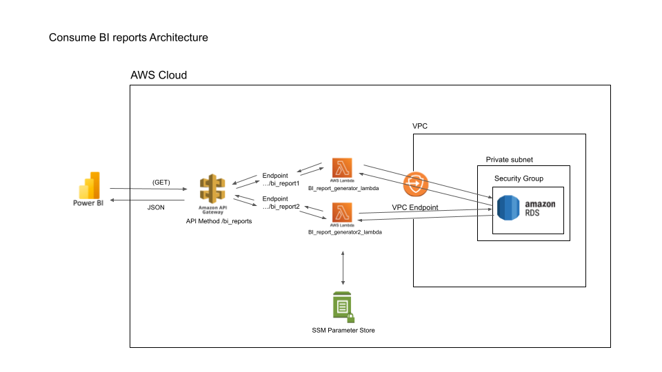
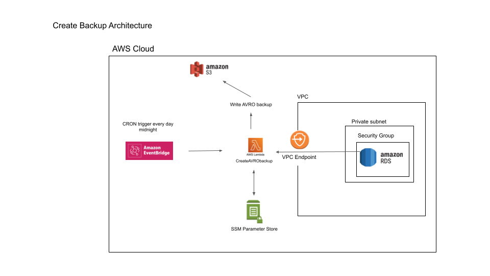
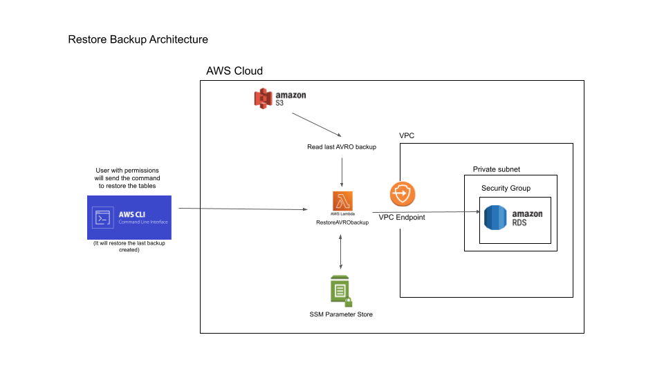

# GLOBANT - POC Project
The main objective of this project is to solve a problem for a professional challenge proposed by Globant. Which consists mainly in a data migration, where the source will be CSV files and its final destination will be a SQL database (in this case I chose the Postgres engine because AWS has a free version for it). 

The first part of the challenge consists of sending the files in batches (with the possibility to do it from 1 to 1000), then performing the validations found in the file /Docs/GlobantChallenge.pdf and finally, writing the transactions (batches) that meet all the conditions in the database. If they do not meet the conditions, a log will be written with the batch information. For my part, I have decided to create a final log to see a summary of the behavior of all batches. On the other hand, we have to create a feature to make a backup in AVRO format and later another feature to be able to restore it.

The second part consists of creating two endpoints to be able to consult two reports that are requested and then create a BI dashboard. 

# Solution
I decided to create the following architecture, which uses 100% cloud services. First, the files are uploaded to s3, then an object creation notification is generated in s3 and this notification triggers a lambda that will start sending the data by batches to the REST API created in API Gateway. The requests made to the API will be the same amount of batches that come out after defining the batch size. The endpoint containing the /migrate method was defined for this task. 

Later this API will fire lambda functions that will do the validations of each batch (1 lambda for 1 batch). If the validations are correct, then the lambda will write to the database. On the contrary, if they are incorrect, the lambda will write in S3 a log with the batch and its respective errors. In the end, the initial lambda will create a history log with the responses of all the lambdas generated by the API.

In order to perform AVRO-type backups, EventBridge will be used, which has a CRON configuration that allows executing a lambda function at midnight every day. If at any time it is required to restore the tables with the AVRO backup, a user with permissions must be requested to execute the backup restore Lambda, it could be from the UI or the AWS CLI. 

Finally, two more endpoints were created to generate two Business Intelligence reports, these endpoints will return a json that can be read by any BI tool. In order to access this endpoint, a QueryStringParameter was configured for the user to type the token that will be provided to them, in order to access the report.  The BI tool used in this case was PowerBI, and the dashboard is located in the /BI_dashboard folder.

# Folders

* **Migration_Lambdas**: It contains the two most relevant lambda functions of the project, the first one that is in charge of sending the batches to the API, and the second one that serves as a backend for the API, in which each batch is validated and written in s3 or in the database, as the case may be.
* **Architecture_Images**: Contains the architecture images for each feature of the challenge.
* **AVRO_backup_feature**: Contains the scripts for the lambda functions that creates the AVRO backup and the lambda that restore that backup into the database tables: Create_Avro_backup.py and Restore_Avro_backup.
* **AWS_Policy**: Contains the JSON files to create the policies required for each role that will use each service. 
* **BI_Dashboard**: Contains the .PBIX file for Power BI, the queries of each endpoint/bi_reports, and a power_query sentence that will help you to set the response from the API to a table in Power BI.
* **Database_Setup_Lambdas**: It contains the lambda functions that were used to create the database snapshot and then run the database from the snapshot. This was done to subsequently perform an infrastructure deployment as code using Cloud Formation.
* **Docs**: Contains the pdf challenge that Globant sent me. 